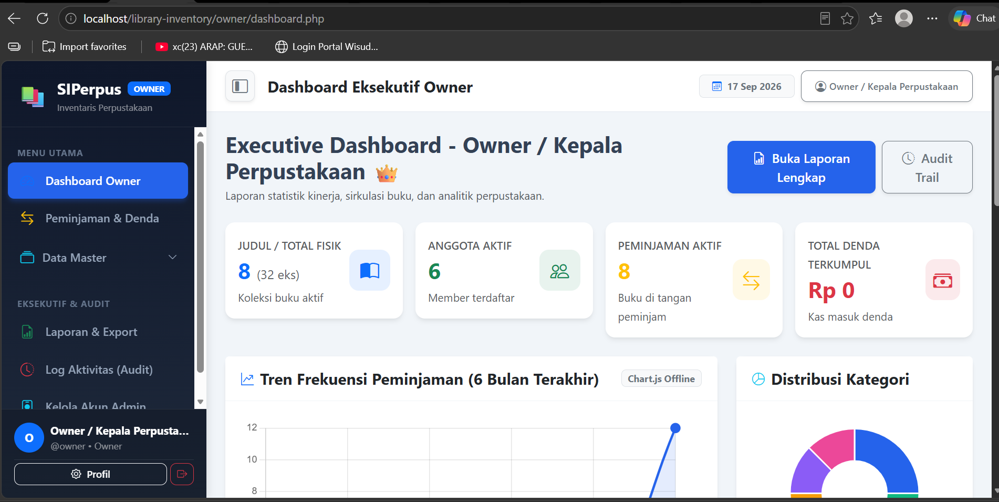
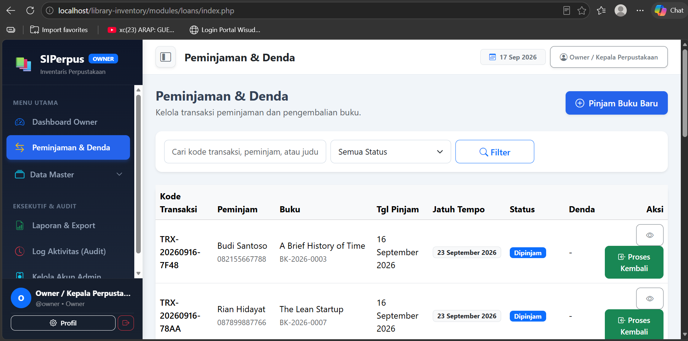
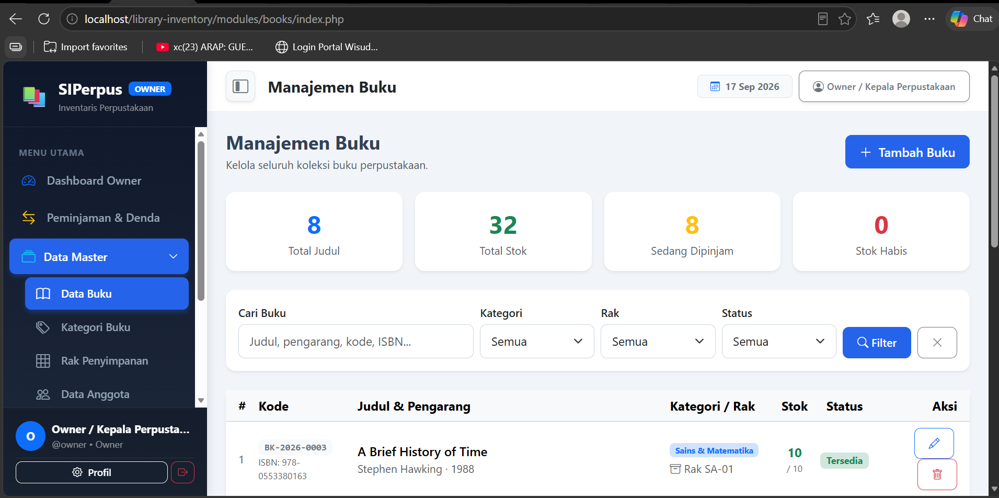
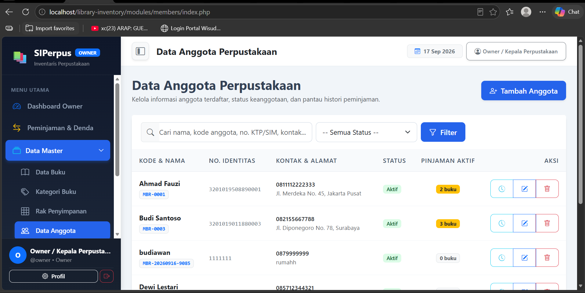
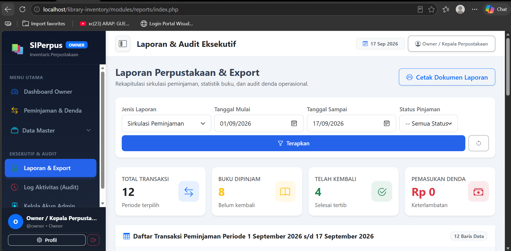

<div align="center">

# 📚 SIPerpus
### Sistem Inventaris Perpustakaan Digital

**Kelola koleksi buku, transaksi peminjaman, denda, hingga laporan perpustakaan dalam satu platform offline.**

[](https://www.php.net)
[](https://www.mysql.com)
[](https://www.apachefriends.org)
[](https://getbootstrap.com)
[](LICENSE)

</div>

---

## 📌 Tentang SIPerpus

**SIPerpus** adalah aplikasi web untuk mengelola inventaris perpustakaan secara digital, dirancang untuk operasional harian perpustakaan sekolah/kampus/umum. Sistem ini membantu petugas mencatat data buku, kategori & lokasi rak, data anggota, transaksi peminjaman dan pengembalian buku beserta perhitungan denda keterlambatan otomatis, hingga laporan dan audit trail aktivitas.

> **100% Berjalan Offline** menggunakan XAMPP (Apache + MySQL), tanpa ketergantungan koneksi internet — cocok untuk demonstrasi maupun penggunaan di lingkungan tanpa akses internet.

---

## ✨ Fitur Utama

- 🔐 **Autentikasi Multi-Role** — Akses terpisah untuk **Admin** (operasional harian) dan **Owner** (kepala perpustakaan/monitoring & laporan).
- 📖 **Manajemen Buku** — CRUD data buku lengkap (judul, penulis, penerbit, ISBN, kategori, rak, stok, status), dengan kode buku otomatis.
- 🏷️ **Kategori & Rak** — Pengelolaan kategori buku dan lokasi rak penyimpanan agar buku mudah ditemukan secara fisik.
- 👥 **Manajemen Anggota** — CRUD data anggota perpustakaan beserta riwayat peminjaman per anggota.
- 🔄 **Transaksi Peminjaman & Pengembalian** — Pencatatan pinjam-kembali buku dengan validasi stok, perhitungan denda otomatis (Rp/hari keterlambatan), serta update status buku otomatis.
- 📊 **Dashboard Real-time** — Statistik total buku, anggota aktif, buku sedang dipinjam, dan peringatan jatuh tempo/keterlambatan.
- 📈 **Laporan & Export** — Rekapitulasi sirkulasi peminjaman, inventaris buku, dan denda (khusus Owner), siap cetak.
- 📝 **Log Aktivitas (Audit Trail)** — Pencatatan seluruh aksi penting pengguna untuk keperluan monitoring Owner.
- 🇮🇩 **Format Rupiah & Bahasa Indonesia** — Seluruh tampilan menggunakan format lokal yang mudah dipahami.

---

### 1. Kredensial Akun Demo

| Role | Username | Password | Akses Utama |
|---|---|---|---|
| **Admin** | `admin` | `admin123` | Dashboard, Peminjaman & Denda, Data Master (Buku, Kategori, Rak, Anggota) |
| **Owner** | `owner` | `owner123` | Semua akses Admin + Laporan & Export, Log Aktivitas, Kelola Akun Admin |

### 2. 🧪 Langkah-Langkah Demo Web

```text
1️⃣ Skenario 1: Transaksi Peminjaman (Role Admin)
   └─ Login menggunakan akun Admin (admin/admin123).
   └─ Buka menu 'Peminjaman & Denda' → klik 'Pinjam Buku Baru'.
   └─ Pilih anggota & buku, lalu simpan. Stok buku otomatis berkurang.

2️⃣ Skenario 2: Pengembalian & Denda Otomatis (Role Admin)
   └─ Dari daftar peminjaman, klik 'Proses Kembali' pada transaksi yang berjalan.
   └─ Sistem otomatis menghitung denda jika tanggal kembali melewati jatuh tempo.
   └─ Stok buku otomatis dikembalikan setelah proses selesai.

3️⃣ Skenario 3: Laporan & Audit (Role Owner)
   └─ Logout, lalu Login menggunakan akun Owner (owner/owner123).
   └─ Buka menu 'Laporan & Export' untuk melihat rekap sirkulasi & denda.
   └─ Buka menu 'Log Aktivitas' untuk memantau seluruh aksi yang tercatat di sistem.
```

---

## 🖥️ Screenshot

| Dashboard Admin | Peminjaman & Denda |
|---|---|
|  |  |

| Manajemen Buku | Data Anggota |
|---|---|
|  |  |

| Laporan & Export (Owner) |
|---|
|  |

---

## 🛠️ Tech Stack

| Teknologi | Kegunaan |
|---|---|
| [PHP Native](https://www.php.net) | Bahasa pemrograman backend (tanpa framework) |
| [MySQL / MariaDB](https://www.mysql.com) | Database relasional untuk penyimpanan data |
| [XAMPP](https://www.apachefriends.org) | Local server (Apache + MySQL) untuk menjalankan aplikasi secara offline |
| [Bootstrap 5](https://getbootstrap.com) | Styling UI & layouting responsif |
| [Bootstrap Icons](https://icons.getbootstrap.com) | Ikon-ikon antarmuka |
| PDO (PHP Data Objects) | Koneksi database aman dengan prepared statement |

---

## 🚀 Cara Menjalankan Lokal

### Prasyarat
- [XAMPP](https://www.apachefriends.org) (Apache + MySQL/MariaDB) sudah terinstall
- Browser modern (Chrome/Edge/Firefox)

### 1. Clone / Copy Project

```bash
git clone https://github.com/username/library-inventory.git
```

Atau copy manual seluruh folder project ke:
```
C:\xampp\htdocs\library-inventory
```

### 2. Jalankan XAMPP

Buka **XAMPP Control Panel**, klik **Start** pada modul **Apache** dan **MySQL** hingga status keduanya berwarna hijau.

### 3. Setup Database

1. Buka `http://localhost/phpmyadmin`
2. Buat database baru dengan nama `library_inventory`
3. Pilih database tersebut → tab **Import** → pilih file `database.sql` dari project → klik **Go**
4. Seluruh tabel dan data contoh (dummy) akan otomatis terbuat

### 4. Konfigurasi Koneksi Database

Buka file `config/database.php`, pastikan konfigurasi berikut sesuai (default XAMPP):

```php
define('DB_HOST', 'localhost');
define('DB_NAME', 'library_inventory');
define('DB_USER', 'root');
define('DB_PASS', '');
```

### 5. Akses Aplikasi

Buka browser dan akses:
```
http://localhost/library-inventory
```

Login menggunakan akun demo Admin atau Owner di atas.

---

## 🗄️ Struktur Database

| Tabel | Deskripsi |
|---|---|
| `users` | Data pengguna sistem (Admin & Owner) |
| `books` | Data buku (judul, penulis, ISBN, kategori, rak, stok, status) |
| `categories` | Kategori buku |
| `shelves` | Lokasi rak penyimpanan buku |
| `members` | Data anggota perpustakaan |
| `loans` | Transaksi peminjaman & pengembalian buku, termasuk denda |
| `activity_logs` | Log audit trail aktivitas pengguna |

Konfigurasi tambahan (dapat diubah di `config/database.php`):
```php
define('DENDA_PER_HARI', 1000);      // Denda keterlambatan per hari
define('DEFAULT_PINJAM_HARI', 7);    // Durasi peminjaman default
```

---

## 📁 Struktur Project

```
library-inventory/
├── admin/
│   └── dashboard.php           # Dashboard operasional Admin
├── owner/
│   └── dashboard.php           # Dashboard eksekutif Owner
├── assets/
│   ├── css/                    # Bootstrap & style kustom (lokal, offline)
│   └── js/                     # Bootstrap bundle JS
├── config/
│   └── database.php            # Koneksi PDO & fungsi helper global
├── includes/
│   ├── auth.php                # require_login(), pengecekan role
│   ├── header.php               # Sidebar navigasi & topbar
│   └── footer.php               # Penutup layout & script
├── modules/
│   ├── auth/                   # Login, logout, profil
│   ├── books/                  # Manajemen buku
│   ├── categories/             # Manajemen kategori
│   ├── shelves/                # Manajemen rak
│   ├── members/                # Manajemen anggota & riwayat peminjaman
│   ├── loans/                  # Transaksi peminjaman & pengembalian
│   ├── reports/                # Laporan & export (Owner)
│   ├── logs/                   # Log aktivitas / audit trail (Owner)
│   └── users/                  # Kelola akun Admin (Owner)
├── database.sql                # Skema database & data contoh (dummy)
├── prd.md                      # Product Requirement Document
├── README.md                   # Dokumentasi utama repository
└── index.php                   # Halaman awal / redirect sesuai sesi login
```

---

<div align="center">

📄 **Lisensi**
Project ini dilindungi di bawah lisensi MIT.

Dibuat untuk kebutuhan digitalisasi inventaris perpustakaan Indonesia 📚

Jangan lupa berikan bintang ⭐ pada repositori ini jika bermanfaat!

</div>
